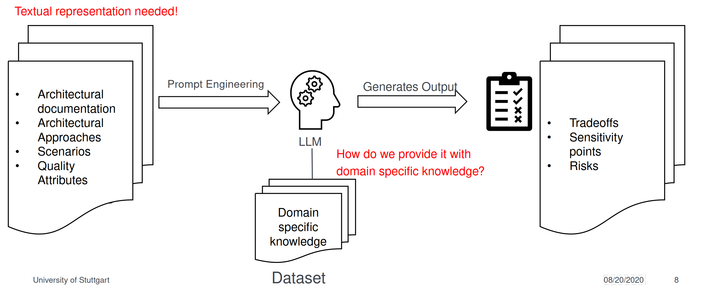
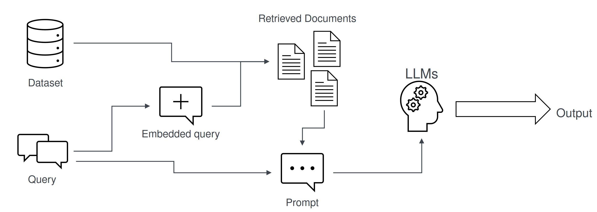

# RAG_ATAM_Tool

An ATAM framework which semi-automatically analyses tradeoffs, risks and sensitivity points using Retrival Augmented Generation (RAG).


## TODOs/Tasks

### Requirements:

#### Objectives

- **Main goal:** <br> 
    Find risks, tradeoffs and sensittivity points of architectural decisions though given scenarios and an initial architecture.
- **Who will use this prototype?** <br>
    Software architects/engineers, need proper knowledge about ATAM and Software Architecture. 
- **What kind of architectural decisions/layouts are you focusing on?** <br>
    *TODO*

#### Context and Scenarios

- **What types of scenarios will the prototype analyze?** <br>
    According ATAM paper (Use Case, Growth, Exploratory)
- **How will they be generated?** <br>
    Manual or automatic? Use LLMs to generate scenarios? Or predefine it? *TODO*
- **How do you envision RAG (Retrieval Augmented Generation) being used in this analysis?** <br>
    Fetch documents, past cases, or architectural frameworks during analysis? *TODO*

#### Data Input

- **What data will the prototype require?** <br>
    1. *Scenarios and their respective quality attribute* <br>
    1. *Architecture description* <br>
    1. *Quality criteria* <br>
    1. *Architectural approaches* 
- **How will this data be structured (Format)?** <br>
    1. *Architectural description:* Use PlantUML Syntax (UML fulfills IEEE P1471 standard)<br>
    1. *Architectural approaches:* List? <br>
    1. *Scenarios:* For each scenario we need a list (Scenario, Attribute, Environment, Stimulus, Response, Architectural)
    1. *Quality criteria:* Text

#### Decision Analysis

- **What is the role of the LLM in analyzing architectural decisions?** <br>
    Find trade-offs, risks and sensitivity points given
- **How to evision the prototype?** <br>
    There should be a GUI where a user can put all necessary inputs in different text fields, the LLM should then list risks, trade-offs and sensitivity points in an output field

#### System components & architecture
*TODO*

#### Functional requirements
*TODO*

#### Non-functional Requirements
*TODO*

#### Output and Reporting
*TODO*

### Concept Design





## Installation (Only compatible with Linux Distros)

**Prerequisities:**

- [Ollama](https://ollama.com/download) with the Llama 3.1 70b model (Click [here](https://medium.com/@gabrielrodewald/running-models-with-ollama-step-by-step-60b6f6125807) and follow the instructions)
- [Python](https://www.python.org/downloads/)  

**For ESE GPU Server:**

1. Create a virtual environment with the following [instructions](https://3.basecamp.com/4433092/buckets/35597770/documents/7773388048)

2. Install all necessary pip packages *(TODO)*

**For local PCs:**

1. Create a virtual environment

```bash
python3 -m venv (name)
source (name)/bin/activate
deactivate // Only when you want to leave the virtual environment
```

2. Install all necessary pip packages *(TODO)*

## Usage

(TODO)

## License

[MIT](https://choosealicense.com/licenses/mit/)