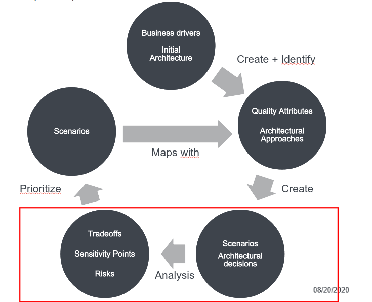
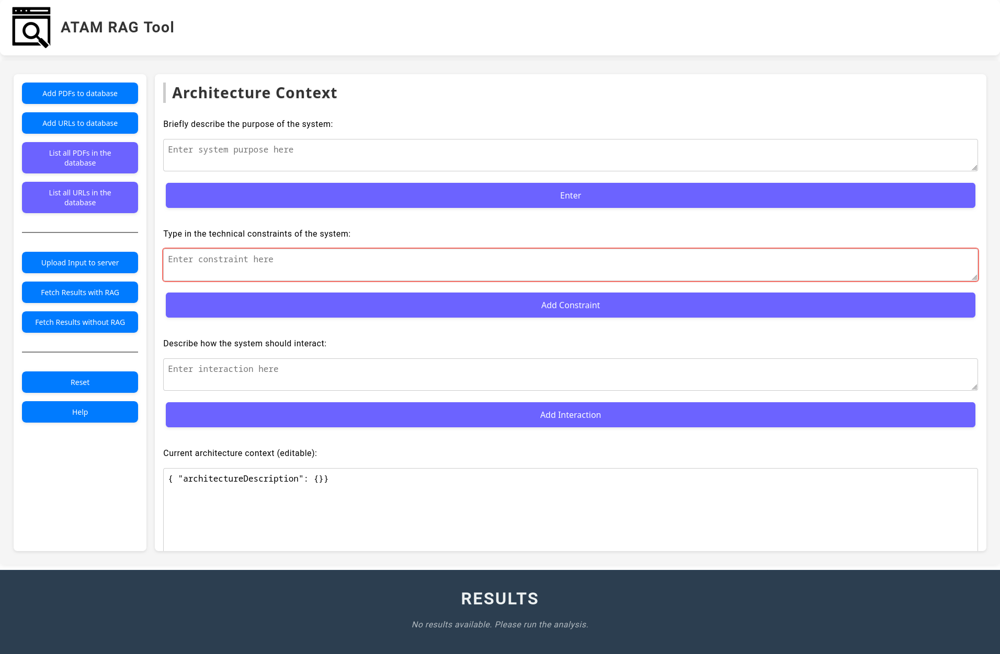
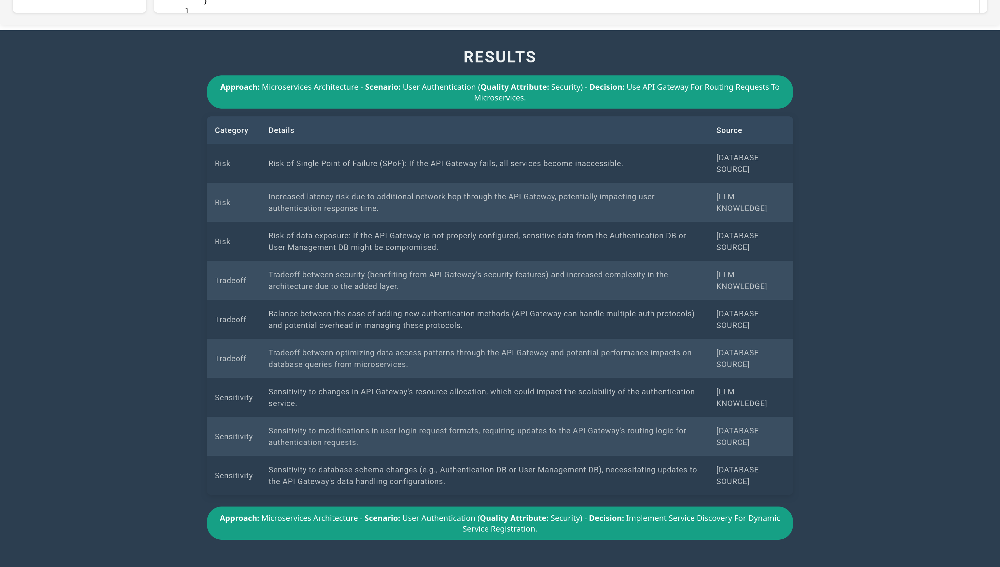

# RAG_ATAM_Tool

An ATAM framework which semi-automatically analyses tradeoffs, risks and sensitivity points using Retrival Augmented Generation (RAG), focusing on qualitative analyses.

The tool focuses on the analysis steps of ATAM using given inputs by the user to facilitate 

### Visual concept of the tool




## Installation (Only compatible with Unix systems)

**Prerequisities:**

- [Ollama](https://ollama.com/download) with the Llama 3.1 70b or nemotron model (Click [here](https://medium.com/@gabrielrodewald/running-models-with-ollama-step-by-step-60b6f6125807) and follow the instructions)
  - For local users who aren't using the GPU server have to ensure that the PC fulfills all the necessary hardware requirements to run the models
- [Python](https://www.python.org/downloads/)  
- [Node.js](https://nodejs.org/en)
- [Angular](https://angular.dev/)

**For ESE GPU Server:**

1. Create a virtual environment with the following [instructions](https://3.basecamp.com/4433092/buckets/35597770/documents/7773388048)

1. Activate virtual environment

    ```bash
    source (name)/bin/activate
    deactivate // Only when you want to leave the virtual environment
    ```

1. Install all necessary pip packages

    ```bash
    pip install -r backend\requirements.txt
    ```

**For local PCs:**

1. Create a virtual environment

    ```bash
    python3 -m venv (name)
    source (name)/bin/activate
    deactivate // Only when you want to leave the virtual environment
    ```

1. Install all necessary pip packages

    ```bash
    pip install -r backend\requirements.txt
    ```

## Usage

Run and open [localhost website](http://localhost:4200/) on port 4200 with

```bash
chmod +x run.sh
./run.sh
```

**OR**

1. Run Python server

    ```bash
    python backend/app.py
    ```

1. Run Angular App Locally on a different terminal

    ```bash
    cd frontend/ATAM-RAG-Tool
    npx -p @angular/cli ng serve
    ```

1. Open [localhost website](http://localhost:4200/) on port 4200. It should look like this:
    

1. Type in all necessary inputs needed for the analysis:
    - **"Add PDFs/URLs":** You can add PDFs/URLs which can be helpful for the architecture analysis
        - **List all PDFs/URLs:** If you want, you can delete/download the PDFs/URLs
    - **"Upload input":** After adding the contents, you can press "Upload input". The contents will then be added to the server in a JSON format <br>
    (*Optional:* you can modify the JSON manually).
        - **Architecture Context:** Here you textually provide the systems purpose, their technical constrints, and main interactions of the product.
        - **Architectural Approaches:**
            - Approach Name: Name of the approach/style.
            - Approach Description: Textual description on how to implement the architectural approach/style into the new product.
            - Architectural decisions: Add major decisions of architectural layout.
            - Different views: You can add three different views in PlantUML syntax.
        - **Quality Attribute Criteria:** Add the name and all necessary criterion/questions to define the quality attribute.
        - **Scenarios (Use Case, Growth, Exploratory)**: 
            - Scenario Name: Title of the scenario.
            - Quality Attribute: Which quality attribute the scenario represents.
            - Environment: Under which conditions does the scenario occur?
            - Stimulus: What is the trigger of the scenario event?
            - Response: How should the system respond to the trigger?
    - **"Fetch Results":**  This button starts the analysis. The response will then be added to the Footer when finished.
        - You can also fetch results without using the RAG database with **"Fetch results without RAG"**

1. After some while, the results at the footer as toggable tables. 

<br>

<details>
  <summary><b>Example inputs</b></summary>

**Architecture concept:**

  ```json
  {
    "architectureDescription": {
        "systemPurpose": "The London Ambulance Service (LAS) Computer-Aided Dispatch (CAD) system was intended to automate the dispatch of ambulances by assisting with receiving emergency calls, tracking ambulance locations using Automatic Vehicle Location System (AVLS), and dispatching ambulances based on resource availability. The system was designed to replace a manual dispatch process and improve response time and resource allocation.",
        "technicalConstraints": [
            "The CAD system required integration with Automatic Vehicle Location System (AVLS) for real-time tracking of ambulances.",
            "Mobile Data Terminals (MDTs) were used for communication with ambulances, which required reliable and clear data input from field personnel.",
            "The system needed to handle high volumes of calls without performance degradation and maintain an accurate and up-to-date database of ambulance statuses and locations.",
            "A backup server was included in the design but was inadequately tested, leading to failures in emergency situations."
        ],
        "systemInteractions": [
            "Receives emergency calls from the public and records necessary information for dispatching.",
            "Communicates with ambulance crews through MDTs, requiring field personnel to input status updates accurately and in sequence.",
            "Tracks real-time location and status of ambulances using AVLS to make optimal dispatch decisions.",
            "Manages and displays exception messages, alerts, and system notifications to dispatch operators."
        ]
    }
}
  ```

**Architectural approaches:**

```json
{
    "architecturalApproaches": [
        {
            "approach": "Layered Architecture with Fault Tolerance",
            "description": "Organize the system into separate layers (e.g., User Interface, Application, and Data), ensuring fault tolerance mechanisms (e.g., failover systems, redundant components) are included to prevent system-wide failures during high-demand periods.",
            "architectural decisions": [
                "Implement a clear separation of concerns between layers.",
                "Introduce fault-tolerant mechanisms to prevent cascading failures.",
                "Use redundant components for high-availability services."
            ],
            "architectural views": [
                {
                    "view": "Development View",
                    "description": "Shows the key components of the system, focusing on the layered approach and fault tolerance between components.",
                    "diagram": "@startuml\npackage LondonAmbulanceSystem {\n  [UI Layer] --> [Application Layer] : communicates\n  [Application Layer] --> [Data Layer] : accesses data\n  [Application Layer] --> [Dispatch Service] : manages dispatch\n  [Dispatch Service] --> [Backup System] : failover\n  [Data Layer] --> [Database] : stores data\n}\n@enduml"
                },
                {
                    "view": "Process View",
                    "description": "Illustrates the flow of requests between layers and highlights the failover processes during high-demand periods.",
                    "diagram": "@startuml\nparticipant User\nparticipant UI_Layer\nparticipant Application_Layer\nparticipant Data_Layer\nparticipant Dispatch_Service\nparticipant Backup_System\nUser -> UI_Layer : request dispatch\nUI_Layer -> Application_Layer : route request\nApplication_Layer -> Dispatch_Service : dispatch ambulance\nDispatch_Service -> Backup_System : check failover\nDispatch_Service --> Data_Layer : fetch location\nData_Layer --> Dispatch_Service : return location\n@enduml"
                },
                {
                    "view": "Physical View",
                    "description": "Defines the physical structure of the layers, including the redundancies and backup systems.",
                    "diagram": "@startuml\nentity Dispatch_Service {\n  * service_id : int\n  * location : string\n  * status : string\n}\nentity Backup_System {\n  * backup_id : int\n  * status : string\n}\nDispatch_Service --> Backup_System : failover\n@enduml"
                }
            ]
        },
        {
            "approach": "Scalable and Distributed Architecture",
            "description": "Use a distributed system to scale horizontally and ensure the system can handle high loads, especially during peak times. Load balancing and cloud-based infrastructure should be leveraged to provide scalability.",
            "architectural decisions": [
                "Use cloud infrastructure for scalability.",
                "Implement load balancing across servers.",
                "Employ microservices to scale individual components based on demand."
            ],
            "architectural views": [
                {
                    "view": "Development View",
                    "description": "Illustrates the components of the system as microservices, showing how they interact and scale independently.",
                    "diagram": "@startuml\npackage LondonAmbulanceSystem {\n  [Dispatch Service] --> [Cloud Load Balancer] : routes requests\n  [Dispatch Service] --> [Cloud Servers] : scales services\n  [Dispatch Service] --> [Database] : accesses data\n  [Backup System] --> [Cloud Servers] : backup scaling\n}\n@enduml"
                },
                {
                    "view": "Process View",
                    "description": "Shows how requests are handled through load balancing and distributed across servers.",
                    "diagram": "@startuml\nparticipant User\nparticipant Cloud_LB\nparticipant Dispatch_Service\nparticipant Cloud_Servers\nUser -> Cloud_LB : send request\nCloud_LB -> Dispatch_Service : route request\nDispatch_Service -> Cloud_Servers : scale service\nDispatch_Service --> Database : fetch data\n@enduml"
                },
                {
                    "view": "Physical View",
                    "description": "Shows the physical deployment of microservices across distributed cloud servers.",
                    "diagram": "@startuml\nentity Dispatch_Service {\n  * service_id : int\n  * status : string\n}\nentity Cloud_Servers {\n  * server_id : int\n  * load_balance : boolean\n}\nDispatch_Service --> Cloud_Servers : runs on\n@enduml"
                }
            ]
        },
        {
            "approach": "Fault-Tolerant and High-Availability Systems",
            "description": "Design the system with built-in redundancy and fault tolerance to ensure high availability, using techniques like data replication, load balancing, and automatic failover during outages.",
            "architectural decisions": [
                "Implement automatic failover systems to ensure service continuity during failures.",
                "Use data replication across multiple nodes for high availability.",
                "Monitor system health to trigger failover or backup systems."
            ],
            "architectural views": [
                {
                    "view": "Development View",
                    "description": "Shows components responsible for fault tolerance, like failover systems, backup servers, and redundant services.",
                    "diagram": "@startuml\npackage LondonAmbulanceSystem {\n  [Main Service] --> [Primary Database] : stores data\n  [Backup System] --> [Primary Database] : replicates data\n  [Main Service] --> [Failover System] : uses for backup\n  [Failover System] --> [Backup Database] : access backup\n}\n@enduml"
                },
                {
                    "view": "Process View",
                    "description": "Illustrates how the system handles failovers during failures, showing the switching process from primary to backup services.",
                    "diagram": "@startuml\nparticipant User\nparticipant Main_Service\nparticipant Failover_System\nparticipant Backup_Service\nUser -> Main_Service : request service\nMain_Service -> Backup_Service : failover request\nFailover_System --> Backup_Service : trigger failover\n@enduml"
                },
                {
                    "view": "Physical View",
                    "description": "Shows the physical infrastructure and redundant components that enable high availability and fault tolerance.",
                    "diagram": "@startuml\nentity Main_Service {\n  * service_id : int\n  * status : string\n}\nentity Failover_System {\n  * failover_id : int\n  * status : string\n}\nentity Backup_Service {\n  * service_id : int\n  * status : string\n}\nMain_Service --> Failover_System : uses\nFailover_System --> Backup_Service : triggers failover\n@enduml"
                }
            ]
        }
    ]
}
```

**Quality attribute criteria:**

```json
{
    "quality_criteria": [
        {
            "attribute": "Reliability",
            "questions": [
                {
                    "question": "How does the architecture ensure continuous system operation under high load?"
                },
                {
                    "question": "What mechanisms are in place to detect and recover from failures in critical components, such as the vehicle locating system (AVLS) or dispatch system?"
                },
                {
                    "question": "How is data accuracy maintained, particularly regarding ambulance location and status?"
                }
            ]
        },
        {
            "attribute": "Performance",
            "questions": [
                {
                    "question": "How does the architecture handle incoming calls and resource allocation requests to ensure minimal delay in response time?"
                },
                {
                    "question": "What strategies are implemented to prevent message queue overflow and to handle large numbers of exception messages?"
                },
                {
                    "question": "How does the system handle the performance of dispatch decisions when there is a spike in calls or a backlog of pending messages?"
                }
            ]
        },
        {
            "attribute": "Usability",
            "questions": [
                {
                    "question": "Is the user interface for dispatch operators and ambulance crews intuitive and easy to use, particularly under stressful, high-pressure conditions?"
                },
                {
                    "question": "What steps are taken to ensure that operators and ambulance crews can quickly enter status information without errors?"
                },
                {
                    "question": "How does the system provide feedback to users to prevent repeated or incorrect entries?"
                }
            ]
        },
        {
            "attribute": "Availability",
            "questions": [
                {
                    "question": "What failover and backup mechanisms are in place to ensure system availability, imageespecially in the event of a primary system failure?"
                },
                {
                    "question": "How frequently are backup systems tested to ensure they will function effectively in a real emergency?"
                },
                {
                    "question": "What is the process for recovering from a full system failure, and how does this minimize downtime?"
                }
            ]
        },
        {
            "attribute": "Scalability",
            "questions": [
                {
                    "question": "How does the system scale to accommodate surges in emergency call volumes, particularly during peak times or incidents that generate many calls?"
                },
                {
                    "question": "What strategies are implemented to ensure the dispatching system can handle high volumes of requests without slowing down?"
                },
                {
                    "question": "What provisions are made to increase system resources dynamically if the demand exceeds current capacity?"
                }
            ]
        },
        {
            "attribute": "Maintainability",
            "questions": [
                {
                    "question": "How easily can the system be modified to adapt to new requirements, such as changes in dispatch protocols or technology updates (e.g., vehicle tracking enhancements)?"
                },
                {
                    "question": "What processes are in place to handle bug fixes and improvements without impacting system reliability or availability?"
                },
                {
                    "question": "How modular is the system, and how easily can individual components be updated or replaced without major changes to the rest of the system?"
                }
            ]
        }
    ]
}
```

**Scenarios:**

```json
{
    "scenarios": [
        {
            "scenario": "Call Processing and Dispatching",
            "attribute": "Performance",
            "environment": "Dispatch System",
            "stimulus": "A call is received, and an ambulance must be dispatched based on location and availability.",
            "response": "The system processes the call and dispatches an appropriate ambulance with minimal delay, ensuring timely response."
        },
        {
            "scenario": "Exception Handling",
            "attribute": "Reliability",
            "environment": "Dispatch System",
            "stimulus": "Multiple exceptions occur due to failed updates or message overload.",
            "response": "The system flags the exceptions, notifies operators, and ensures that the queue does not overflow, allowing for prompt resolution."
        },
        {
            "scenario": "Vehicle Location Update",
            "attribute": "Performance",
            "environment": "Vehicle Tracking System (AVLS)",
            "stimulus": "An ambulance moves to a new location.",
            "response": "The system updates the ambulance's location in real-time and ensures that dispatch decisions are based on accurate information."
        },
        {
            "scenario": "Manual Dispatch Mode",
            "attribute": "Usability",
            "environment": "Dispatch System",
            "stimulus": "The automated dispatch system fails, and operators must manually dispatch ambulances.",
            "response": "Operators are able to manually dispatch ambulances with minimal error and confusion, relying on a simple and clear interface."
        },
        {
            "scenario": "High Call Volume",
            "attribute": "Scalability",
            "environment": "Dispatch System",
            "stimulus": "The system experiences a surge in incoming calls due to a major incident or high traffic volume.",
            "response": "The system scales up by prioritizing calls and dispatching available resources, maintaining response times even under load."
        },
        {
            "scenario": "System Recovery from Failure",
            "attribute": "Availability",
            "environment": "Dispatch System",
            "stimulus": "The primary dispatch system experiences a failure (e.g., server crash).",
            "response": "The backup system kicks in immediately to continue dispatch operations with minimal disruption to service."
        },
        {
            "scenario": "Data Synchronization",
            "attribute": "Reliability",
            "environment": "Mobile Data Terminals (MDTs)",
            "stimulus": "An ambulance unit updates its status or location.",
            "response": "The system ensures the updates are synchronized across all relevant components, maintaining an accurate and consistent database."
        }
    ]
}
```
</details>

<details>
<summary><b>Example Output</b></summary>
Display of the results with a category (risk, sensitivity point, tradeoff), a qualitative description, and the type of source which gets used for argumentation



</details>

<details>
<summary><b>For developers</b></summary>

## Requirements (For developers)

### Objectives

- **Main goal:** <br> 
    Find risks, tradeoffs and sensittivity points of architectural decisions though given scenarios and an initial architecture.
- **Who will use this prototype?** <br>
    Software architects/engineers, need proper knowledge about ATAM and Software Architecture.
- **What kind of architectural decisions/layouts are you focusing on?** <br>
    All patterns.

### Context and Scenarios

- **What types of scenarios will the prototype analyze?** <br>
    According ATAM paper (Use Case, Growth, Exploratory)
- **How will they be generated?** <br>
    User has to manually create them.
- **How do you envision RAG (Retrieval Augmented Generation) being used in this analysis?** <br>
    As many styles as possible (by gathering enough data)

### Data Input

- **What data will the prototype require?** <br>

    1. *Scenarios and their respective quality attribute*
    1. *Architecture description/context*
    1. *Quality criteria*
    1. *Architectural approaches*

- **How will this data be structured (Format)?**

    1. *Architecture context:*

        - technical constraints such as an OS, hardware, or middleware prescribed for use
        - other systems with which the system must interact
        - System purpose

        ```json
        {
            "architectureDescription": {
                "systemPurpose": "The SecureLoginApp provides a secure, scalable, and modular authentication solution for user management. It enables secure user authentication, session management, and logging while ensuring compliance with security and performance standards. The architecture is designed to facilitate seamless interaction with external services, scalability for high traffic volumes, and flexibility for future expansions.",
                "technicalConstraints": [
                    "Operating System: Linux-based servers for backend, iOS/Android compatibility for frontend.",
                    "Middleware: NGINX as the API gateway and Redis for session management.",
                    "Hardware: Deployed on cloud infrastructure with minimum 4 cores and 16 GB RAM per server instance."
                ],
                "systemInteractions": [
                    "Integrates with external Identity Providers (IDPs) for OAuth2-based authentication.",
                    "Communicates with a centralized logging service for auditing and monitoring.",
                    "Interacts with a customer data service for personalized user experience."
                ]
            }
        }

        ```

    2. *Architectural approaches:* Approach, Description, Architectural Decisions, Architectural Views (Physical, Process, Deployment)

        ```json
        {
            "architecturalApproaches": [
                {
                    "approach": "Microservices Architecture",
                    "description": "Decompose the SecureLoginApp into distinct services, such as Authentication, User Management, and Logging, with each service having its own database. This approach isolates components, enhances scalability, and enables independent deployment.",
                    "architectural decisions": [
                        "Use API Gateway for routing requests to microservices.",
                        "Implement service discovery for dynamic service registration."
                    ],
                    "architectural views": [
                        {
                            "view": "Development View",
                            "description": "Illustrates how microservices are deployed and interact with each other, including load balancing and service discovery mechanisms.",
                            "diagram": "TODO: Add diagram here"
                        },
                        {
                            "view": "Process View",
                            "description": "Shows the flow of data between microservices, including request and response messages, data transformations, and error handling.",
                            "diagram": "TODO: Add diagram here"
                        },
                        {
                            "view": "Physical View",
                            "description": "Defines the data models used by each microservice, including database schemas, data formats, and data access patterns.",
                            "diagram": "TODO: Add diagram here"
                        }
                    ]
                },
                {
                    "approach": "Layered Architecture",
                    "description": "Separate SecureLoginApp into layers, including Presentation, Business Logic, and Data Access. This structure promotes separation of concerns, making it easier to manage, test, and modify each layer individually.",
                    "architectural decisions": [
                        "Use Dependency Injection to manage component dependencies.",
                        "Implement a Repository pattern for data access."
                    ],
                    "architectural views": [
                        {
                            "view": "Development View",
                            "description": "Illustrates how layers are deployed and their interactions, focusing on the separation of concerns.",
                            "diagram": "TODO: Add diagram here"
                        },
                        {
                            "view": "Process View",
                            "description": "Shows the flow of data within the application layers, detailing interactions between layers.",
                            "diagram": "TODO: Add diagram here"
                        },
                        {
                            "view": "Physical View",
                            "description": "Defines the internal structures of each layer, including class diagrams and data models.",
                            "diagram": "TODO: Add diagram here"
                        }
                    ]
                },
                {
                    "approach": "Event-Driven Architecture",
                    "description": "Implement an event-driven system where actions, such as a successful login, trigger notifications and auditing events. This architecture helps decouple components and ensures that they can respond to events asynchronously, improving the app's responsiveness.",
                    "architectural decisions": [
                        "Use an event bus for communication between components.",
                        "Implement a listener pattern to handle events."
                    ],
                    "architectural views": [
                        {
                            "view": "Development View",
                            "description": "Illustrates how event-driven components are deployed and interact with each other.",
                            "diagram": "TODO: Add diagram here"
                        },
                        {
                            "view": "Process View",
                            "description": "Shows the flow of events and data through the system, detailing event triggers and responses.",
                            "diagram": "TODO: Add diagram here"
                        },
                        {
                            "view": "Physical View",
                            "description": "Defines the data structures used in events, including payloads and schemas.",
                            "diagram": "TODO: Add diagram here"
                        }
                    ]
                },
                {
                    "approach": "Service-Oriented Architecture (SOA)",
                    "description": "Organize SecureLoginApp services around business functions, like Authentication and User Profile Management. Each service communicates over standardized protocols, promoting reusability and allowing flexible, independent scaling and updating of services.",
                    "architectural decisions": [
                        "Use API Gateway for routing requests to services.",
                        "Standardize communication protocols (e.g., REST, SOAP)."
                    ],
                    "architectural views": [
                        {
                            "view": "Development View",
                            "description": "Illustrates how services are deployed and interact with each other, including routing and load balancing.",
                            "diagram": "TODO: Add diagram here"
                        },
                        {
                            "view": "Process View",
                            "description": "Shows the interactions between services, including service calls and data exchanges.",
                            "diagram": "TODO: Add diagram here"
                        },
                        {
                            "view": "Physical View",
                            "description": "Defines the data models and formats used by each service, including APIs and data storage.",
                            "diagram": "TODO: Add diagram here"
                        }
                    ]
                },
                {
                    "approach": "Monolithic Architecture",
                    "description": "Build SecureLoginApp as a single-tiered application where all components, including UI, business logic, and data handling, are contained within a single platform. This approach simplifies deployment and debugging but may impact scalability as the application grows.",
                    "architectural decisions": [
                        "Use a single database for all components.",
                        "Employ a cohesive framework for development."
                    ],
                    "architectural views": [
                        {
                            "view": "Development View",
                            "description": "Illustrates how the entire application is deployed as a single unit.",
                            "diagram": "TODO: Add diagram here"
                        },
                        {
                            "view": "Process View",
                            "description": "Shows the internal flow of data within the monolithic application, detailing request handling.",
                            "diagram": "TODO: Add diagram here"
                        },
                        {
                            "view": "Physical View",
                            "description": "Defines the internal structure of the application, including modules, components, and data storage.",
                            "diagram": "TODO: Add diagram here"
                        }
                    ]
                }
            ]
        }
        ```

        PlantUML Diagrams for Architectural Views:

        ```plantuml
        UML Sequence Diagram as Process View:
        @startuml
        actor User
        participant "Web Server" as WS
        participant "Application Server" as AS
        participant "Database" as DB

        User -> WS: Request Login
        WS -> AS: Forward Login Request
        AS -> DB: Validate Credentials
        DB --> AS: Credentials Valid/Invalid
        AS --> WS: Login Success/Failure
        WS --> User: Show Login Status
        @enduml
        ----------------------------------------

        UML Deployment Diagram as Physical View
        @startuml
        node "Client" as Client

        node "Web Server" as Web {
            [Web Application]
            note right of Web
                CPU: 4 cores
                RAM: 8 GB
                Network: 1 Gbps
            end note
        }

        node "Application Server" as App {
            [Business Logic Service]
            note right of App
                CPU: 8 cores
                RAM: 16 GB
                Network: 1 Gbps
            end note
        }

        node "Database Server" as DBServer {
            [Database]
            note right of DBServer
                CPU: 8 cores
                RAM: 32 GB
                Disk: 1 TB SSD
            end note
        }

        Client --> Web : HTTP Request
        Web --> App : HTTP Request
        App --> DBServer : SQL Query
        @enduml
        ----------------------------------------

        UML Component Diagram as Development View
        @startuml
        package "Web Application" {
            component "User Interface" as UI
            component "Business Logic" as BL
            component "Data Access Layer" as DAL

            UI --> BL: Uses
            BL --> DAL: Uses
        }

        note top of BL : Handles login and data processing
        note top of DAL : Interacts with database
        @enduml
        ```

    3. *Scenarios:* For each scenario we need a list (Scenario, Attribute, Environment, Stimulus, Response)

        ```json
        {
            "scenarios": [
                {
                    "scenario": "User Authentication",
                    "attribute": "Security",
                    "environment": "Web Application",
                    "stimulus": "User enters valid login credentials.",
                    "response": "User is authenticated and granted access to the system."
                },
                {
                    "scenario": "Data Retrieval",
                    "attribute": "Performance",
                    "environment": "Mobile Application",
                    "stimulus": "User requests data from the server.",
                    "response": "Data is retrieved and displayed within an acceptable response time."
                },
                {
                    "scenario": "Password Reset",
                    "attribute": "Modifiability",
                    "environment": "Web Application",
                    "stimulus": "User requests a password reset.",
                    "response": "User receives a reset link via email and can update their password."
                },
                {
                    "scenario": "High Traffic Management",
                    "attribute": "Scalability",
                    "environment": "Cloud Infrastructure",
                    "stimulus": "High number of concurrent login attempts.",
                    "response": "System scales to handle the increased load without degradation in performance."
                }
            ]
        }
        ```

    4. *Quality criteria:*

        ```json
        {
            "quality_criteria": [
                {
                    "attribute": "Modifiability",
                    "questions": [
                        {
                            "question": "If this architecture includes layers/facades, are there any places where the layers/facades are circumvented?"
                        },
                        {
                            "question": "If a shared data type changes, how many parts of the architecture are affected?"
                        },
                        {
                            "question": "How easy is it to add new authentication methods to the system?"
                        }
                    ]
                },
                {
                    "attribute": "Performance",
                    "questions": [
                        {
                            "question": "If there are multiple processes competing for a shared resource, how are priorities assigned to these processes?"
                        },
                        {
                            "question": "What measures are in place to optimize response time for user authentication?"
                        }
                    ]
                },
                {
                    "attribute": "Security",
                    "questions": [
                        {
                            "question": "What mechanisms are in place to prevent unauthorized access to sensitive data?"
                        },
                        {
                            "question": "How does the architecture handle secure communication between components?"
                        }
                    ]
                },
                {
                    "attribute": "Scalability",
                    "questions": [
                        {
                            "question": "How well can the system handle increased user loads without performance degradation?"
                        },
                        {
                            "question": "What are the strategies for scaling the authentication service as user demand grows?"
                        }
                    ]
                },
                {
                    "attribute": "Usability",
                    "questions": [
                        {
                            "question": "How intuitive is the user interface for logging in and managing accounts?"
                        },
                        {
                            "question": "What feedback mechanisms are provided to users during the authentication process?"
                        }
                    ]
                }
            ]
        }
        ```

- **How will the input prompt look like (for information retriever and LLM)?** <br>
    For each (Architectural approach, decision, scenario)-tuple:
    ```python
    """
    <CONTEXT>
    Use the context and your own knowledge to fulfill the task: 
    {context}
    </CONTEXT>

    -----

    <INPUT>
    User's input data:
    Architecture Context: \n{architecture_context}
    Architectural Approach Description: \n{approach_description}
    Architectural Views: \n{architectural_views}
    Quality Criteria: \n{quality_criteria}
    Scenario: \n{scenario}
    </INPUT>

    -----

    <TASK>
    We are conducting a qualitative analysis based on ATAM. You are given multiple architectural view in PlantUML format.

    Task:
    Provide the risks, tradeoffs, and sensitivity points regarding the scenario in the architectural decision: {decision}.
    Use the input data provided, marking any external knowledge as [LLM KNOWLEDGE] and sources from the context section as [DATABASE SOURCE].
    For each risk/tradeoff/sensitivity point, provide a point for each architectural view (3 in total).
    Consider the technical constraints from the architecture context.
    </TASK>

    -----
    Format response as json format. Don't use any other formats and especially don't add any additional characters or spaces:
    
    {{
     "architecturalApproach": "{current_approach}",
     "scenario": {{
         "name": "{scenario_name}",
         "qualityAttribute": "{quality_attribute}"
     }},
     "architecturalDecision": "{decision}",
     "risks": [
         {{
         "source": "[LLM KNOWLEDGE/DATABASE SOURCE]",
         "details": "(enter risks)"
         }}
     ],
     "tradeoffs": [
         {{
         "source": "[LLM KNOWLEDGE/DATABASE SOURCE]",
         "details": "(enter tradeoffs)"
         }}
     ],
     "sensitivityPoints": [
         {{
         "source": "[LLM KNOWLEDGE/DATABASE SOURCE]",
         "details": "(enter sensitivity points)"
         }}
     ]
    }}
    ```


### Decision Analysis

- **What is the role of the LLM in analyzing architectural decisions?** <br>
    Find trade-offs, risks and sensitivity points given the input
- **How to evision the prototype?** <br>
    There should be a GUI where a user can put all necessary inputs (mentioned above) in different text fields, the LLM should then list risks, trade-offs and sensitivity points in an output field

### System components & architecture

- **What are the major components of the prototype?**
  - Frontend: Angular
  - Backend: Flask Server, Ollama, Langchain
  - RAG database: ChromaDB
  - LLM (Llama 3.1:70b, 8b, or nemotron)
  - Retrieval model:
    - mistral for retrieval prompt generation
    - nomic-embed-text for embedding
  - temporary input folder while there aren't any existing frontend applications
  - temporary responses folder where the results will be stored.
- **What kind of information should the database contain?**
  - DataType: PDFs
  - Scientific articles + webpages mentioning risks, tradeoffs and sensitivity points of different architectural styles/decisions
  - Will be saved in data

### Functional requirements

1. Scenario and Architecture Input Handling <br>
    - The system should allow users to input architectural descriptions (PlantUML syntax) with multiple views (Process, Deployment, Physical).
    - Users should be able to enter predefined scenarios that include attributes, environments, stimuli, responses, and architectural decisions.
    - The system should validate and parse the data formats for architecture descriptions, scenarios, quality criteria, and architectural approaches.

1. RAG-Driven Analysis
    - The tool should use Retrieval-Augmented Generation to reference relevant architectural styles, case studies, and patterns from a structured RAG database.
    - It should automatically extract relevant documents, frameworks, and past cases during analysis based on input queries.

1. Qualitative Analysis of Quality Attributes
    - The tool should analyze the architecture and scenarios for quality attributes (e.g., security, modifiability, performance) based on quality criteria and display associated risks, trade-offs, and sensitivity points.
    - LLM should classify results by quality attribute and provide analysis reports for each attribute individually.

1. Identification of Trade-offs, Risks, and Sensitivity Points
    - The tool should automatically identify and display trade-offs, risks, and sensitivity points based on architecture and quality attribute inputs.
    - It should provide visual summaries of identified risks, trade-offs, and sensitivity points for quick review.

1. User Interface and Interaction
    - The system should feature a GUI where users can input architecture data and scenarios and view the generated analysis results.
    - It should provide input fields and options for each section (scenarios, quality criteria, architectural decisions, architectural approaches).
    - Users should be able to save or export the analysis results, reports, and visualizations for documentation purposes.

1. Report Generation
    - Generate a comprehensive report that includes detailed analysis on architectural decisions, quality attributes, trade-offs, risks, and sensitivity points.
    - Support export options for the report (e.g., PDF, text).
    - Visualized as a table

1. Database Management
    - The system should manage and update a RAG database, including PDFs (scientific articles)
    - Provide mechanisms for adding new data and removing or modifying outdated data entries.

### Success  Metrics

- **How do we measure the quality of the solutions?** <br>
    **TODO**

## Updates

### Update 08.12.2024

- Added code commenting in backend
- You can now delete PDFs/URLs from the frontend and their respective chunks in the ChromaDB

### Update 03.12.2024

- Website can now display results in a table

### Update 13.11.2024

- query.py can now format the responses from the LLM into json.
- stored in backend/respones/responses.json

### Update 11.11.2024

- query.py can now chunk the whole input data and send multiple requests to the model for more precise analysis

### Update 04.11.2024

- Added first components of RAG database
  - Text splitter
  - Get embedding function
  - build database with embedded documents
- Next steps:
  - implement information retriever
  - Work on prompt template
  - Work on input format

### Update 29.10.24

- Too many architectural approaches in one prompt is difficult for the LLM to process
  - Generates completely different outputs compared to the prompt.

<details>

## License

[MIT](https://choosealicense.com/licenses/mit/)