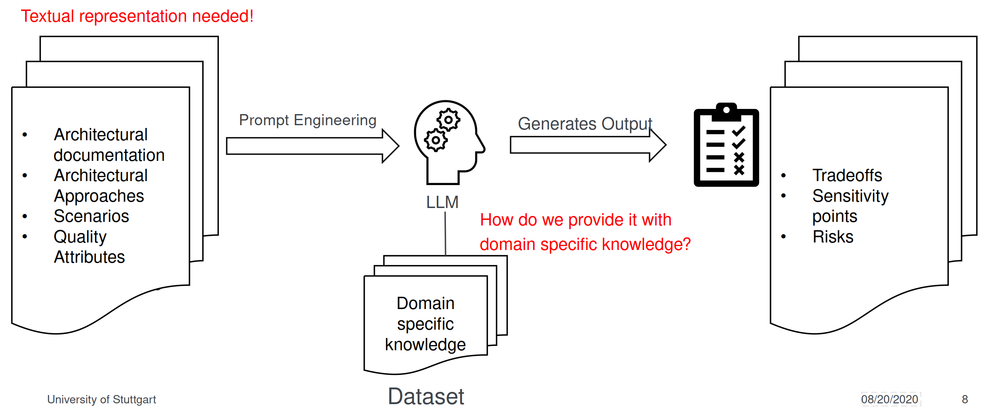
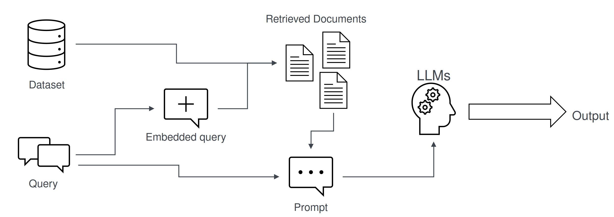
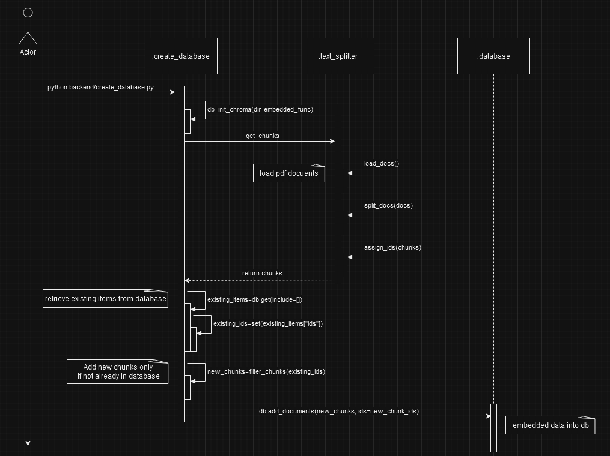
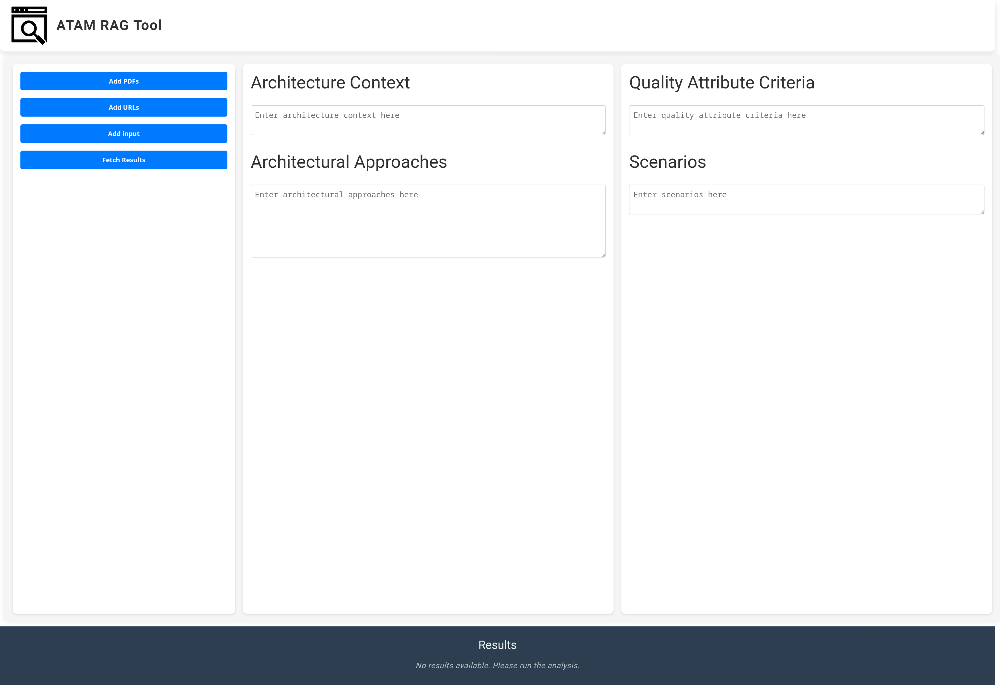

# RAG_ATAM_Tool

An ATAM framework which semi-automatically analyses tradeoffs, risks and sensitivity points using Retrival Augmented Generation (RAG), focusing on qualitative analyses.

### Concept Design




Rough sequence diagram of the creation/update of the database: <br>


## Installation (Only compatible with Unix systems)

**Prerequisities:**

- [Ollama](https://ollama.com/download) with the Llama 3.1 70b or nemotron model (Click [here](https://medium.com/@gabrielrodewald/running-models-with-ollama-step-by-step-60b6f6125807) and follow the instructions)
- [Python](https://www.python.org/downloads/)  
- [Node.js](https://nodejs.org/en)

**For ESE GPU Server:**

1. Create a virtual environment with the following [instructions](https://3.basecamp.com/4433092/buckets/35597770/documents/7773388048)

1. Activate virtual environment

    ```bash
    source (name)/bin/activate
    deactivate // Only when you want to leave the virtual environment
    ```

1. Install all necessary pip packages

    ```bash
    pip install -r backend\requirements.txt
    ```

**For local PCs:**

1. Create a virtual environment

    ```bash
    python3 -m venv (name)
    source (name)/bin/activate
    deactivate // Only when you want to leave the virtual environment
    ```

1. Install all necessary pip packages

    ```bash
    pip install -r backend\requirements.txt
    ```

## Usage

Run **./run.sh** OR

1. Run Python server

    ```bash
    python backend/app.py
    ```

1. Run Angular App Locally on a different terminal 

    ```bash
    cd frontend/ATAM-RAG-Tool
    npx -p @angular/cli ng serve
    ```

1. Open [localhost website](http://localhost:4200/) on port 4200. It should look like this:
    

1. Type in all necessary inputs needed for the analysis:
    - "Add PDFs/URLs": You can add PDFs/URLs which can be helpful for the architecture analysis
    - **"Upload input":** After adding the contents, you can press "Upload input". The contents will then be added to the server in a JSON format.
        - **Architecture Context:** Here you textually provide the systems purpose, their technical constrints, and main interactions of the product.
        - **Architectural Approaches:**
            - Approach Name: Name of the approach/style.
            - Approach Description: Textual description on how to implement the architectural approach/style into the new product.
            - Architectural decisions: Add major decisions of architectural layout.
            - Different views: You can add three different views in PlantUML syntax.
        - **Quality Attribute Criteria:** Add the name and all necessary criterion/questions to define the quality attribute.
        - **Scenarios: 
            - Scenario Name: Title of the scenario.
            - Quality Attribute: Which quality attribute the scenario represents.
            - Environment: Under which conditions does the scenario occur?
            - Stimulus: What is the trigger of the scenario event?
            - Response: How should the system respond to the trigger?
    - "Fetch Results":  This button starts the analysis. The response will then be added to the Footer when finished.
        - You can also fetch results without using the RAG database with "Fetch results without RAG"

## Requirements

### Objectives

- **Main goal:** <br> 
    Find risks, tradeoffs and sensittivity points of architectural decisions though given scenarios and an initial architecture.
- **Who will use this prototype?** <br>
    Software architects/engineers, need proper knowledge about ATAM and Software Architecture.
- **What kind of architectural decisions/layouts are you focusing on?** <br>
    *TODO*

### Context and Scenarios

- **What types of scenarios will the prototype analyze?** <br>
    According ATAM paper (Use Case, Growth, Exploratory)
- **How will they be generated?** <br>
    Manual or automatic? Use LLMs to generate scenarios? Or predefine it? *TODO*
- **How do you envision RAG (Retrieval Augmented Generation) being used in this analysis?** <br>
    Fetch documents, past cases, or architectural frameworks during analysis? *TODO*

### Data Input

- **What data will the prototype require?** <br>

    1. *Scenarios and their respective quality attribute*
    1. *Architecture description*
    1. *Quality criteria*
    1. *Architectural approaches*
- **How will this data be structured (Format)?**

    1. *Architecture context:*

        - technical constraints such as an OS, hardware, or middleware prescribed for use
        - other systems with which the system must interact
        - System purpose

        ```json
        {
            "architectureDescription": {
                "systemPurpose": "The SecureLoginApp provides a secure, scalable, and modular authentication solution for user management. It enables secure user authentication, session management, and logging while ensuring compliance with security and performance standards. The architecture is designed to facilitate seamless interaction with external services, scalability for high traffic volumes, and flexibility for future expansions.",
                "technicalConstraints": [
                    "Operating System: Linux-based servers for backend, iOS/Android compatibility for frontend.",
                    "Middleware: NGINX as the API gateway and Redis for session management.",
                    "Hardware: Deployed on cloud infrastructure with minimum 4 cores and 16 GB RAM per server instance."
                ],
                "systemInteractions": [
                    "Integrates with external Identity Providers (IDPs) for OAuth2-based authentication.",
                    "Communicates with a centralized logging service for auditing and monitoring.",
                    "Interacts with a customer data service for personalized user experience."
                ]
            }
        }

        ```

    2. *Architectural approaches:* Approach, Description, Architectural Decisions, Architectural Views (Physical, Process, Deployment)

        ```json
        {
            "architecturalApproaches": [
                {
                    "approach": "Microservices Architecture",
                    "description": "Decompose the SecureLoginApp into distinct services, such as Authentication, User Management, and Logging, with each service having its own database. This approach isolates components, enhances scalability, and enables independent deployment.",
                    "architectural decisions": [
                        "Use API Gateway for routing requests to microservices.",
                        "Implement service discovery for dynamic service registration."
                    ],
                    "architectural views": [
                        {
                            "view": "Development View",
                            "description": "Illustrates how microservices are deployed and interact with each other, including load balancing and service discovery mechanisms.",
                            "diagram": "TODO: Add diagram here"
                        },
                        {
                            "view": "Process View",
                            "description": "Shows the flow of data between microservices, including request and response messages, data transformations, and error handling.",
                            "diagram": "TODO: Add diagram here"
                        },
                        {
                            "view": "Physical View",
                            "description": "Defines the data models used by each microservice, including database schemas, data formats, and data access patterns.",
                            "diagram": "TODO: Add diagram here"
                        }
                    ]
                },
                {
                    "approach": "Layered Architecture",
                    "description": "Separate SecureLoginApp into layers, including Presentation, Business Logic, and Data Access. This structure promotes separation of concerns, making it easier to manage, test, and modify each layer individually.",
                    "architectural decisions": [
                        "Use Dependency Injection to manage component dependencies.",
                        "Implement a Repository pattern for data access."
                    ],
                    "architectural views": [
                        {
                            "view": "Development View",
                            "description": "Illustrates how layers are deployed and their interactions, focusing on the separation of concerns.",
                            "diagram": "TODO: Add diagram here"
                        },
                        {
                            "view": "Process View",
                            "description": "Shows the flow of data within the application layers, detailing interactions between layers.",
                            "diagram": "TODO: Add diagram here"
                        },
                        {
                            "view": "Physical View",
                            "description": "Defines the internal structures of each layer, including class diagrams and data models.",
                            "diagram": "TODO: Add diagram here"
                        }
                    ]
                },
                {
                    "approach": "Event-Driven Architecture",
                    "description": "Implement an event-driven system where actions, such as a successful login, trigger notifications and auditing events. This architecture helps decouple components and ensures that they can respond to events asynchronously, improving the app's responsiveness.",
                    "architectural decisions": [
                        "Use an event bus for communication between components.",
                        "Implement a listener pattern to handle events."
                    ],
                    "architectural views": [
                        {
                            "view": "Development View",
                            "description": "Illustrates how event-driven components are deployed and interact with each other.",
                            "diagram": "TODO: Add diagram here"
                        },
                        {
                            "view": "Process View",
                            "description": "Shows the flow of events and data through the system, detailing event triggers and responses.",
                            "diagram": "TODO: Add diagram here"
                        },
                        {
                            "view": "Physical View",
                            "description": "Defines the data structures used in events, including payloads and schemas.",
                            "diagram": "TODO: Add diagram here"
                        }
                    ]
                },
                {
                    "approach": "Service-Oriented Architecture (SOA)",
                    "description": "Organize SecureLoginApp services around business functions, like Authentication and User Profile Management. Each service communicates over standardized protocols, promoting reusability and allowing flexible, independent scaling and updating of services.",
                    "architectural decisions": [
                        "Use API Gateway for routing requests to services.",
                        "Standardize communication protocols (e.g., REST, SOAP)."
                    ],
                    "architectural views": [
                        {
                            "view": "Development View",
                            "description": "Illustrates how services are deployed and interact with each other, including routing and load balancing.",
                            "diagram": "TODO: Add diagram here"
                        },
                        {
                            "view": "Process View",
                            "description": "Shows the interactions between services, including service calls and data exchanges.",
                            "diagram": "TODO: Add diagram here"
                        },
                        {
                            "view": "Physical View",
                            "description": "Defines the data models and formats used by each service, including APIs and data storage.",
                            "diagram": "TODO: Add diagram here"
                        }
                    ]
                },
                {
                    "approach": "Monolithic Architecture",
                    "description": "Build SecureLoginApp as a single-tiered application where all components, including UI, business logic, and data handling, are contained within a single platform. This approach simplifies deployment and debugging but may impact scalability as the application grows.",
                    "architectural decisions": [
                        "Use a single database for all components.",
                        "Employ a cohesive framework for development."
                    ],
                    "architectural views": [
                        {
                            "view": "Development View",
                            "description": "Illustrates how the entire application is deployed as a single unit.",
                            "diagram": "TODO: Add diagram here"
                        },
                        {
                            "view": "Process View",
                            "description": "Shows the internal flow of data within the monolithic application, detailing request handling.",
                            "diagram": "TODO: Add diagram here"
                        },
                        {
                            "view": "Physical View",
                            "description": "Defines the internal structure of the application, including modules, components, and data storage.",
                            "diagram": "TODO: Add diagram here"
                        }
                    ]
                }
            ]
        }
        ```

        PlantUML Diagrams for Architectural Views:

        ```plantuml
        UML Sequence Diagram as Process View:
        @startuml
        actor User
        participant "Web Server" as WS
        participant "Application Server" as AS
        participant "Database" as DB

        User -> WS: Request Login
        WS -> AS: Forward Login Request
        AS -> DB: Validate Credentials
        DB --> AS: Credentials Valid/Invalid
        AS --> WS: Login Success/Failure
        WS --> User: Show Login Status
        @enduml
        ----------------------------------------

        UML Deployment Diagram as Physical View
        @startuml
        node "Client" as Client

        node "Web Server" as Web {
            [Web Application]
            note right of Web
                CPU: 4 cores
                RAM: 8 GB
                Network: 1 Gbps
            end note
        }

        node "Application Server" as App {
            [Business Logic Service]
            note right of App
                CPU: 8 cores
                RAM: 16 GB
                Network: 1 Gbps
            end note
        }

        node "Database Server" as DBServer {
            [Database]
            note right of DBServer
                CPU: 8 cores
                RAM: 32 GB
                Disk: 1 TB SSD
            end note
        }

        Client --> Web : HTTP Request
        Web --> App : HTTP Request
        App --> DBServer : SQL Query
        @enduml
        ----------------------------------------

        UML Component Diagram as Deployment View
        @startuml
        package "Web Application" {
            component "User Interface" as UI
            component "Business Logic" as BL
            component "Data Access Layer" as DAL

            UI --> BL: Uses
            BL --> DAL: Uses
        }

        note top of BL : Handles login and data processing
        note top of DAL : Interacts with database
        @enduml
        ```

    3. *Scenarios:* For each scenario we need a list (Scenario, Attribute, Environment, Stimulus, Response)

        ```json
        {
            "scenarios": [
                {
                    "scenario": "User Authentication",
                    "attribute": "Security",
                    "environment": "Web Application",
                    "stimulus": "User enters valid login credentials.",
                    "response": "User is authenticated and granted access to the system."
                },
                {
                    "scenario": "Data Retrieval",
                    "attribute": "Performance",
                    "environment": "Mobile Application",
                    "stimulus": "User requests data from the server.",
                    "response": "Data is retrieved and displayed within an acceptable response time."
                },
                {
                    "scenario": "Password Reset",
                    "attribute": "Modifiability",
                    "environment": "Web Application",
                    "stimulus": "User requests a password reset.",
                    "response": "User receives a reset link via email and can update their password."
                },
                {
                    "scenario": "High Traffic Management",
                    "attribute": "Scalability",
                    "environment": "Cloud Infrastructure",
                    "stimulus": "High number of concurrent login attempts.",
                    "response": "System scales to handle the increased load without degradation in performance."
                }
            ]
        }
        ```

    4. *Quality criteria:*

        ```json
        {
            "quality_criteria": [
                {
                    "attribute": "Modifiability",
                    "questions": [
                        {
                            "question": "If this architecture includes layers/facades, are there any places where the layers/facades are circumvented?"
                        },
                        {
                            "question": "If a shared data type changes, how many parts of the architecture are affected?"
                        },
                        {
                            "question": "How easy is it to add new authentication methods to the system?"
                        }
                    ]
                },
                {
                    "attribute": "Performance",
                    "questions": [
                        {
                            "question": "If there are multiple processes competing for a shared resource, how are priorities assigned to these processes?"
                        },
                        {
                            "question": "What measures are in place to optimize response time for user authentication?"
                        }
                    ]
                },
                {
                    "attribute": "Security",
                    "questions": [
                        {
                            "question": "What mechanisms are in place to prevent unauthorized access to sensitive data?"
                        },
                        {
                            "question": "How does the architecture handle secure communication between components?"
                        }
                    ]
                },
                {
                    "attribute": "Scalability",
                    "questions": [
                        {
                            "question": "How well can the system handle increased user loads without performance degradation?"
                        },
                        {
                            "question": "What are the strategies for scaling the authentication service as user demand grows?"
                        }
                    ]
                },
                {
                    "attribute": "Usability",
                    "questions": [
                        {
                            "question": "How intuitive is the user interface for logging in and managing accounts?"
                        },
                        {
                            "question": "What feedback mechanisms are provided to users during the authentication process?"
                        }
                    ]
                }
            ]
        }
        ```

- **How will the input prompt look like (for information retriever and LLM)?** <br>
    For each (Architectural approach, decision, scenario)-tuple:
    ```python
    """
    <CONTEXT>
    Use the context and your own knowledge to fulfill the task: 
    {context}
    </CONTEXT>

    -----

    <INPUT>
    User's input data:
    Architecture Context: \n{architecture_context}
    Architectural Approach Description: \n{approach_description}
    Architectural Views: \n{architectural_views}
    Quality Criteria: \n{quality_criteria}
    Scenario: \n{scenario}
    </INPUT>

    -----

    <TASK>
    We are conducting a qualitative analysis based on ATAM.

    Task:
    Provide the risks, tradeoffs, and sensitivity points for the scenario in the architectural decision: {decision}.
    Use the input data provided, marking any external knowledge as [LLM KNOWLEDGE].
    </TASK>

    -----
    Format response as. Don't use any other formats:

    # Architectural Approach: {current_approach}
    ## Scenario: {scenario_name}; Quality Attribute: {quality_attribute}
    ### Architectural Decision: {decision}

    #### Risks: [LLM KNOWLEDGE/DATABASE SOURCE](enter risks)
    - (enter risks)

    #### Tradeoffs: [LLM KNOWLEDGE/DATABASE SOURCE](enter tradeoffs)
    - (enter tradeoffs)

    #### Sensitivity Points: [LLM KNOWLEDGE/DATABASE SOURCE](enter sensitivity points)
    - (enter sensitivity points)
    """
    ```

- How does the output look like?

    ```python
    """
    Analyzing: Microservices Architecture - Implement service discovery for dynamic service registration. - Password Reset
    ---------------------------------------------------------
    START OF RESPONSE:

    # Architectural Approach: Microservices Architecture
    ## Scenario: Password Reset; Quality Attribute: Modifiability
    ### Architectural Decision: Implement service discovery for dynamic service registration.

    #### Risks: [LLM KNOWLEDGE]
    - **Increased Complexity**: Adding a service discovery mechanism can introduce additional complexity to the system, potentially leading to longer development and debugging times.
    - **Security Vulnerabilities**: If not properly secured, dynamic service registration can expose the system to security risks, such as unauthorized service registrations or man-in-the-middle attacks.
    - **Dependence on Discovery Service Uptime**: The overall system's availability may become dependent on the uptime of the service discovery mechanism, introducing a potential single point of failure.

    #### Tradeoffs: [DATABASE SOURCE - Input Data Quality Criteria]
    - **Modifiability vs. Complexity**: Enhancing modifiability through dynamic service registration may trade off with increased system complexity.
    - **Scalability vs. Security**: Allowing for dynamic registrations can improve scalability but may compromise security if not properly implemented, as noted in the quality criteria questions related to security.
    - **Performance Optimization**: The decision might also involve trading off some performance optimization (e.g., slightly slower initial service discovery) for the benefit of easier modification and scaling.

    #### Sensitivity Points: [LLM KNOWLEDGE]
    - **Service Registration Validation Mechanisms**: How robust are the validation mechanisms for new service registrations? Weak validations could lead to security breaches.
    - **Discovery Service Scalability**: Can the service discovery mechanism scale in tandem with the growing number of services, or will it become a bottleneck?
    - **Monitoring and Logging Implementations**: Are comprehensive monitoring and logging tools in place to quickly identify and respond to issues arising from dynamic service registrations?

    Sources: ['backend/data/www.linkedin.com_advice_0_what-some-common-security-risks-challenges.pdf:1:1', 'backend/data/www.linkedin.com_advice_0_what-some-common-security-risks-challenges.pdf:23:0', 'backend/data/www.linkedin.com_advice_0_what-some-common-security-risks-challenges.pdf:3:2', 'backend/data/A_REVIEW_ON_SOFTWARE_ARCHITECTURAL_PATTERNS.pdf:4:9']

    END OF RESPONSE
    ---------------------------------------------------------
    """
    ```

### Decision Analysis

- **What is the role of the LLM in analyzing architectural decisions?** <br>
    Find trade-offs, risks and sensitivity points given the input
- **How to evision the prototype?** <br>
    There should be a GUI where a user can put all necessary inputs (mentioned above) in different text fields, the LLM should then list risks, trade-offs and sensitivity points in an output field

### System components & architecture

- **What are the major components of the prototype?** <br>
    Frontend: React or Vue.js for input<br>
    Backend: python server using flask? LLM processing using ollama library, <br>
  - RAG database 
  - LLM (Llama 3.1:70b or 8b)
  - temporary input folder while there aren't any existing frontend applications 
  - information retriver 
  - utils for (error handling, logging, etc.)
  - an app handling http requests
- **What kind of information should the database contain?**
    homogeneous/heterogeneous? <br>
    Architecture Patterns and Styles <br>
    Quality Attributes and Impact <br>
    Tradeoff Points <br>
    Risk Catalog <br>
    Sensitivity Points <br>
    Architectural Decisions Repository <br>
    Real-World Case Studies  

### Functional requirements

1. Scenario and Architecture Input Handling <br>
    - The system should allow users to input architectural descriptions (PlantUML syntax) with multiple views (Process, Deployment, Physical).
    - Users should be able to enter predefined scenarios that include attributes, environments, stimuli, responses, and architectural decisions.
    - The system should validate and parse the data formats for architecture descriptions, scenarios, quality criteria, and architectural approaches.

1. RAG-Driven Analysis
    - The tool should use Retrieval-Augmented Generation to reference relevant architectural styles, case studies, and patterns from a structured RAG database.
    - It should automatically extract relevant documents, frameworks, and past cases during analysis based on input queries.

1. Qualitative Analysis of Quality Attributes
    - The tool should analyze the architecture and scenarios for quality attributes (e.g., security, modifiability, performance) based on quality criteria and display associated risks, trade-offs, and sensitivity points.
    - LLM should classify results by quality attribute and provide analysis reports for each attribute individually.

1. Identification of Trade-offs, Risks, and Sensitivity Points
    - The tool should semi-automatically identify and display trade-offs, risks, and sensitivity points based on architecture and quality attribute inputs.
    - It should provide visual summaries of identified risks, trade-offs, and sensitivity points for quick review.

1. User Interface and Interaction
    - The system should feature a GUI where users can input architecture data and scenarios and view the generated analysis results.
    - It should provide input fields and options for each section (scenarios, quality criteria, architectural decisions, architectural approaches).
    - Users should be able to save or export the analysis results, reports, and visualizations for documentation purposes.

1. Report Generation
    - Generate a comprehensive report that includes detailed analysis on architectural decisions, quality attributes, trade-offs, risks, and sensitivity points.
    - Support export options for the report (e.g., PDF, text).

1. Database Management
    - The system should manage and update a RAG database, including real-world case studies, architectural patterns, and decisions.
    - Provide mechanisms for adding new data and removing or modifying outdated data entries.

### Success  Metrics

- **How do we measure the quality of the solutions?** <br>
    **TODO**

## Updates

### Update 12.03.2024

- Website can now display results in a table

### Update 13.11.2024

- query.py can now format the responses from the LLM into json.
- stored in backend/respones/responses.json

### Update 11.11.2024

- query.py can now chunk the whole input data and send multiple requests to the model for more precise analysis

### Update 04.11.2024

- Added first components of RAG database
  - Text splitter
  - Get embedding function
  - build database with embedded documents
- Next steps:
  - implement information retriever
  - Work on prompt template
  - Work on input format

### Update 29.10.24

- Too many architectural approaches in one prompt is difficult for the LLM to process
  - Generates completely different outputs compared to the prompt.


## License

[MIT](https://choosealicense.com/licenses/mit/)